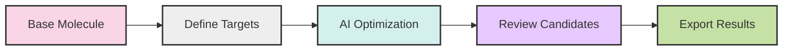

# 🧬 KPGT: AI-Powered Drug Discovery Assistant

<div align="center">


[](https://opensource.org/licenses/MIT)
[](https://reactjs.org/)
[](https://pytorch.org/)
[](CONTRIBUTING.md)

</div>

<p align="center">
  <i>Revolutionizing drug discovery through AI and knowledge graphs.</i>
</p>

---

<details open>
<summary>📋 Table of Contents</summary>

- [✨ Overview](#-overview)
- [🚀 Features](#-features)
- [🎬 Demo](#-demo)
- [⚙️ Installation](#️-installation)
- [🏗️ Architecture](#️-architecture)
- [💻 Usage](#-usage)
- [🔬 Technical Details](#-technical-details)
- [🗺️ Roadmap](#️-roadmap)
- [🤝 Contributing](#-contributing)
- [📚 Citation](#-citation)
- [⚖️ License](#️-license)
- [🙏 Acknowledgments](#-acknowledgments)

</details>

---

## ✨ Overview

<div align="center">
  
```
Molecule → [ KPGT 🧠 ] → 💊 Drug Candidate
```

</div>

**KPGT (Knowledge-Powered Generative Transformer)** is a cutting-edge AI platform that accelerates pharmaceutical research through advanced machine learning techniques. By bridging the gap between computational chemistry and AI, KPGT enables researchers to:

- 🔍 Identify promising drug candidates in minutes, not months
- 🧪 Predict molecular interactions with unprecedented accuracy
- ⚗️ Optimize compounds for efficacy, bioavailability, and safety
- 📊 Analyze vast pharmaceutical knowledge graphs for context-aware predictions

<div align="center">
<table>
<tr>
<td align="center">
<b>Traditional Approach</b><br>
🕒 Years of Research<br>
💰 Billions in Cost<br>
📉 High Failure Rate
</td>
<td align="center">
<h3>VS</h3>
</td>
<td align="center">
<b>KPGT Approach</b><br>
⚡ Accelerated Discovery<br>
📈 Higher Success Rate<br>
💵 Reduced R&D Costs
</td>
</tr>
</table>
</div>

---

## 🚀 Features

<div align="center">

| 🧠 AI-Powered Analysis | 🔗 Knowledge Integration | 👁️ Interactive Visualization |
|:----------------------:|:------------------------:|:-----------------------------:|
| Deep learning models predict compound properties | Comprehensive pharmaceutical knowledge graphs | Explore molecules in intuitive 3D space |

| 🎯 Fine-Tuned Models | 👥 Collaboration | 📑 Literature Analysis |
|:--------------------:|:----------------:|:----------------------:|
| Specialized models trained on pharmaceutical data | Real-time sharing with team members | Extract insights from scientific papers |

</div>

- **💡 Smart Compound Generation**: Generate novel molecules targeting specific proteins
- **🔄 Iterative Optimization**: Refine compounds through AI-guided feedback loops
- **⚠️ Toxicity Prediction**: Early identification of potential adverse effects
- **🧩 Fragment-Based Design**: Build compounds from functional fragments
- **🔮 Binding Affinity Prediction**: Estimate target protein binding strength

---

## 🎬 Demo

<div align="center">
  

  <p><i>KPGT in action: Drug candidate generation for SARS-CoV-2 main protease</i></p>
</div>

---

## ⚙️ Installation

### Prerequisites

<div align="center">

| Requirement | Version | Description |
|-------------|---------|-------------|
| Node.js | ≥ 16.x | JavaScript runtime |
| NPM | ≥ 8.x | Package manager |
| GPU | CUDA-compatible | Recommended for optimal performance |

</div>

### ✨ One-Line Setup

```bash
git clone https://github.com/mohitrawat061/kpgt-frontend.git && cd kpgt-frontend && npm install && npm run dev
```

### Step-by-Step Setup

<details>
<summary>Click to expand detailed instructions</summary>

```bash
# Clone the repository
git clone https://github.com/mohitrawat061/kpgt-frontend.git
cd kpgt-frontend

# Install dependencies
npm install

# Configure environment variables
cp .env.example .env
# Edit .env with your API keys and configuration

# Start the development server
npm run dev
```

</details>

---

## 🏗️ Architecture

<div align="center">
  
</div>

KPGT employs a sophisticated five-layer architecture:

1. **🖥️ Frontend Layer**: React-based UI with interactive molecular visualizations
2. **🔌 API Layer**: FastAPI backend handling requests and model serving
3. **🧠 ML Engine**: PyTorch models with transfer learning capabilities
4. **📊 Knowledge Graph**: Neo4j database storing pharmaceutical relationships
5. **🔍 Vector Database**: For similarity search and efficient retrieval

<div align="center">

```
User → React Frontend → FastAPI Backend → ML Engine → Results
                          ↕️                  ↕️
                Knowledge Graph ←→ Vector Database
```

</div>

---

## 💻 Usage

### 💊 Drug Candidate Generation

```jsx
// Generate promising drug candidates with just a few lines of code
import { KPGTClient } from './services/kpgt';

const client = new KPGTClient();
const results = await client.generateDrugCandidates({
  targetProtein: 'EGFR',
  constraints: {
    molecularWeight: { min: 200, max: 500 },
    logP: { min: 1, max: 5 }
  },
  count: 10
});
```

### 🧪 Molecule Optimization

<div align="center">
  


</div>

1. **Select** a base molecule
2. **Define** optimization targets (binding affinity, solubility, etc.)
3. **Run** the AI optimization process
4. **Review** and export optimized candidates

---

## 🔬 Technical Details

### 🧠 ML Fine-Tuning Approach

<div align="center">
  
</div>

KPGT's machine learning pipeline leverages:

- **Self-supervised pretraining** on millions of molecular structures
- **Supervised fine-tuning** on compound-protein interaction data
- **Few-shot learning** for rare disease targets
- **Active learning loops** for continuous model improvement
- **Uncertainty quantification** to identify reliable predictions

### 🔗 Knowledge Graph Technology

<div align="center">

| Data Source | Content | Integration Method |
|-------------|---------|-------------------|
| PubChem | 100M+ compounds | API + Regular updates |
| ChEMBL | Bioactivity data | Full database integration |
| DrugBank | Approved medications | Curated knowledge edges |
| Literature | Research findings | NLP extraction pipeline |

</div>

---

## 🗺️ Roadmap

<div align="center">

```
2024 Q2 ──────────────────────────────────────────────────► 2025
   │                  │                  │                  │
   ▼                  ▼                  ▼                  ▼
Core Property    Multi-parameter    Toxicity          Clinical Trial
Prediction      Optimization      Enhancement       Data Integration
```

</div>

- [x] Core molecular property prediction engine
- [x] 3D structure visualization interface
- [x] Knowledge graph integration framework
- [ ] Multi-parameter optimization system
- [ ] Enhanced toxicity prediction models
- [ ] Cloud-based distributed computing
- [ ] Clinical trial data integration
- [ ] Automated research report generation

---

## 🤝 Contributing

<div align="center">
  
</div>

We welcome contributions from the community! Whether you're fixing bugs, adding features, or improving documentation, your help is appreciated.

<details>
<summary>How to contribute</summary>

1. Fork the repository
2. Create a feature branch: `git checkout -b amazing-feature`
3. Commit your changes: `git commit -m 'Add amazing feature'`
4. Push to the branch: `git push origin amazing-feature`
5. Open a Pull Request

See the [Contributing Guidelines](CONTRIBUTING.md) for detailed instructions.
</details>

---

## 📚 Citation

If you use KPGT in your research, please cite:

```bibtex
@software{kpgt2024,
  author = {Rawat, Mohit and Team},
  title = {KPGT: AI-Powered Drug Discovery Assistant},
  year = {2024},
  url = {https://github.com/mohitrawat061/kpgt-frontend}
}
```

---

## ⚖️ License

<div align="center">
  
[](https://opensource.org/licenses/MIT)

</div>

This project is licensed under the MIT License - see the [LICENSE](LICENSE) file for details.

---

## 🙏 Acknowledgments

<div align="center">
  
*"If I have seen further, it is by standing on the shoulders of giants."* - Isaac Newton

</div>

- Thanks to all contributors who have invested their time and expertise
- Special recognition to our research partners in computational chemistry
- Funding provided by [Funding Organization]

---

<div align="center">


**[Website](https://kpgt.ai)** • **[Documentation](https://docs.kpgt.ai)** • **[Blog](https://blog.kpgt.ai)**

<i>Transforming the future of pharmaceutical research, one molecule at a time.</i>

</div>
